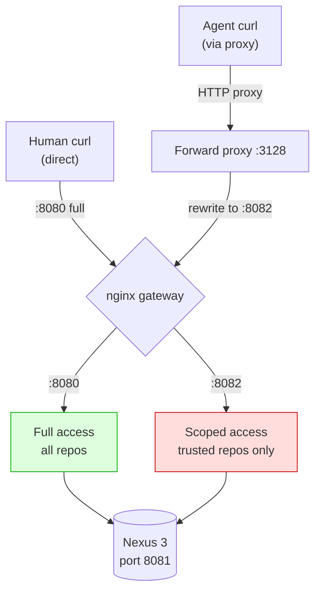

# PoC 0: HTTP Baseline

[Back to overview](../README.md)

Proof of concept for the destination-port routing architecture described in
[`nexus-agent-trust-problem.md`](../nexus-agent-trust-problem.md).

## What it demonstrates



Port 8080 (nginx to Nexus): full access. Humans connect here directly.
Port 8082 (nginx to Nexus): scoped access. Only `/repository/trusted/` is
served; everything else under `/repository/` returns 403.
Forward proxy (port 3128): a transparent HTTP/CONNECT proxy that rewrites
the destination port from 8080 to 8082 for Nexus traffic. Does not inspect
or terminate TLS.

## Architecture mapping to the paper

| Paper concept | PoC implementation |
|---|---|
| Nexus plugin reading `getLocalPort()` | nginx location rules on port 8082 |
| Forward proxy rewriting destination port | Python HTTP/CONNECT proxy |
| Host firewall forcing traffic through proxy | docker-compose network isolation |
| Agent uses `HTTPS_PROXY` env | curl `-x http://forward-proxy:3128` |

The nginx layer stands in for the Nexus plugin in the PoC. In production, the
same path-filtering would live inside a Java servlet filter that reads
`ServletRequest.getLocalPort()`.

## Running

```bash
cd 01-http-baseline/
docker-compose up --build
```

The stack:
1. Starts Nexus (takes 60 to 120 seconds to become writable).
2. Waits for Nexus, creates `trusted` and `untrusted` raw repos, uploads test
   artifacts.
3. Starts the nginx gateway and forward proxy.
4. Runs the test suite automatically.

Watch the `[forward-proxy]` logs to see the port rewriting in action:
```
docker-compose logs forward-proxy
```

## Expected output

<details>
<summary>Test suite output</summary>

```
======================================================
  Nexus Agent-Trust PoC - Test Suite
======================================================

--- Scenario 1: HUMAN via full port (8080) ---
  PASS: human reads trusted (HTTP 200)
  PASS: human reads untrusted (HTTP 200)

--- Scenario 2: AGENT via scoped port (8082 direct) ---
  PASS: agent reads trusted (HTTP 200)
  PASS: agent blocked from untrusted (HTTP 403)

--- Scenario 3: AGENT via FORWARD PROXY (port 8080 to 8082) ---
  PASS: agent-via-proxy reads trusted (HTTP 200)
  PASS: agent-via-proxy blocked from untrusted (HTTP 403)

======================================================
  Results: 6 passed, 0 failed
======================================================
```

</details>

## Manual testing

Once the stack is running, open another terminal:

```bash
# Human access: everything works
curl -u admin:admin123 http://localhost:28080/repository/trusted/test-pkg.txt
curl -u admin:admin123 http://localhost:28080/repository/untrusted/test-pkg.txt

# Scoped access: untrusted blocked
curl -u admin:admin123 http://localhost:28082/repository/trusted/test-pkg.txt
curl -u admin:admin123 http://localhost:28082/repository/untrusted/test-pkg.txt

# Via forward proxy: agent sees scoped view despite requesting 8080
curl -x http://localhost:23128 -u admin:admin123 \
    http://gateway:8080/repository/untrusted/test-pkg.txt
```

Nexus UI is available at `http://localhost:18081` (admin/admin123).

## Cleaning up

```bash
docker-compose down -v
```

## Notes

- The PoC uses HTTP (not HTTPS) for simplicity. The forward proxy's CONNECT
  handler demonstrates the HTTPS path-rewriting approach (rewriting the
  destination port in the CONNECT request) but is not exercised in the
  automated tests.
- Nexus 3.93 (Community Edition) requires EULA acceptance before any
  operations. The init script accepts it automatically via the REST API
  (`POST /service/rest/v1/system/eula` with the disclaimer text).
- Host port mappings are `18081` (Nexus UI), `28080` (full access),
  `28082` (scoped access), `23128` (forward proxy) to avoid conflicts.
  Internal container ports follow the paper's convention (8081, 8080, 8082, 3128).
- Nexus takes 30 to 90 seconds to start. The init script polls every 5 seconds.
