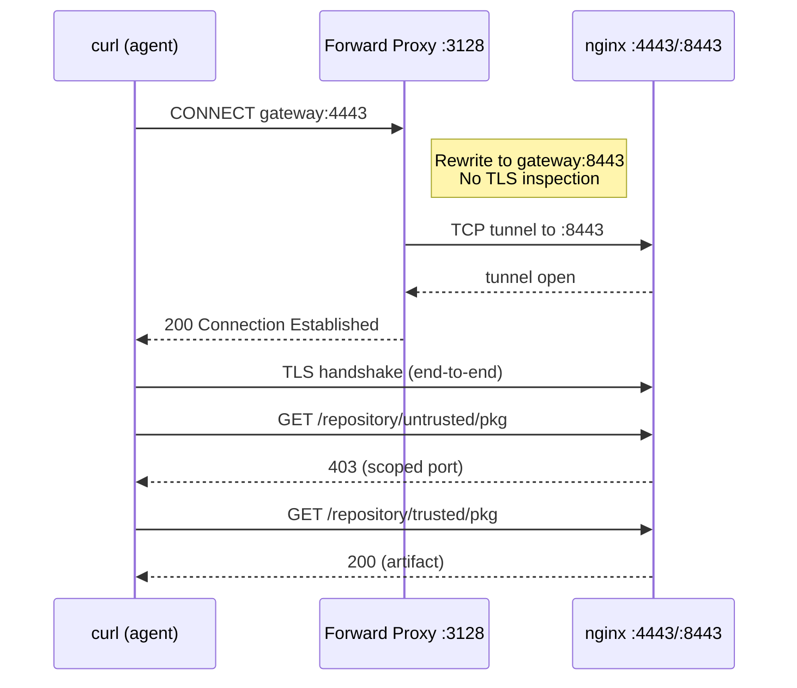

# PoC 1: HTTPS CONNECT Tunnel

[Back to overview](../README.md)

Proves the forward proxy rewrites the destination port inside a CONNECT
request without terminating or inspecting TLS.

## What it demonstrates



The proxy holds no certificates. TLS is between client and gateway.

## Running

```bash
cd 02-https-connect/
docker-compose up -d
# Wait ~90s for Nexus + init
docker logs 02-https-connect-tester-1
```

## Manual testing

```bash
CA=02-https-connect/certs/ca-cert.pem

# Human: direct HTTPS, full access
curl --cacert $CA -u admin:admin123 \
    https://localhost:34443/repository/untrusted/test-pkg.txt

# Agent via CONNECT proxy: scoped access
curl --cacert $CA -u admin:admin123 \
    -x http://localhost:3128 \
    https://gateway:4443/repository/untrusted/test-pkg.txt
# Expect: 403
```

## Files

- `certs/generate.sh`: generates CA, server cert, server key
- `nginx/gateway.conf`: HTTPS listeners on 4443 (full) and 8443 (scoped)
- `init/setup-nexus.sh`: creates trusted/untrusted repos, uploads artifacts
- `test/run-tests.sh`: 6 tests (3 scenarios x 2 repos)

## Expected output

<details>
<summary>Test suite output</summary>

```
======================================================
  PoC 1: HTTPS CONNECT Tunnel
======================================================

--- Scenario 1: HUMAN direct HTTPS (port 4443) --------
  PASS: human reads trusted via HTTPS (HTTP 200)
  PASS: human reads untrusted via HTTPS (HTTP 200)

--- Scenario 2: AGENT scoped HTTPS (port 8443) --------
  PASS: agent reads trusted via HTTPS (HTTP 200)
  PASS: agent blocked from untrusted via HTTPS (HTTP 403)

--- Scenario 3: AGENT via CONNECT proxy (4443->8443) ---
  PASS: agent via CONNECT reads trusted (HTTP 200)
  PASS: agent via CONNECT blocked from untrusted (HTTP 403)

======================================================
  Results: 6 passed, 0 failed
======================================================
```

</details>

<details>
<summary>Forward proxy logs</summary>

```
[forward-proxy] listening on 0.0.0.0:3128
[forward-proxy] rewrites gateway:4443 -> gateway:8443
[forward-proxy] CONNECT REWRITE gateway:4443 -> gateway:8443
[forward-proxy] 192.168.0.4 "CONNECT gateway:4443 HTTP/1.1" 200 -
```

The proxy has no server cert, no CA cert, and no private key. TLS is
end-to-end between client and gateway.

</details>

## Port mappings

| Host port | Container port | Purpose |
|---|---|---|
| 18081 | 8081 | Nexus UI |
| 34443 | 4443 | Full HTTPS access (human) |
| 38443 | 8443 | Scoped HTTPS access (agent) |
| 3128 | 3128 | Forward proxy |

## Cleaning up

```bash
docker-compose down -v
```

## Notes

- Self-signed certs are generated by `certs/generate.sh`. The CA cert
  (`ca-cert.pem`) must be trusted by the client.
- The forward proxy only rewrites traffic destined for the `gateway`
  hostname. Other HTTPS traffic passes through unchanged.
- Nexus takes 60 to 120 seconds to start. The init script polls every 5
  seconds.
