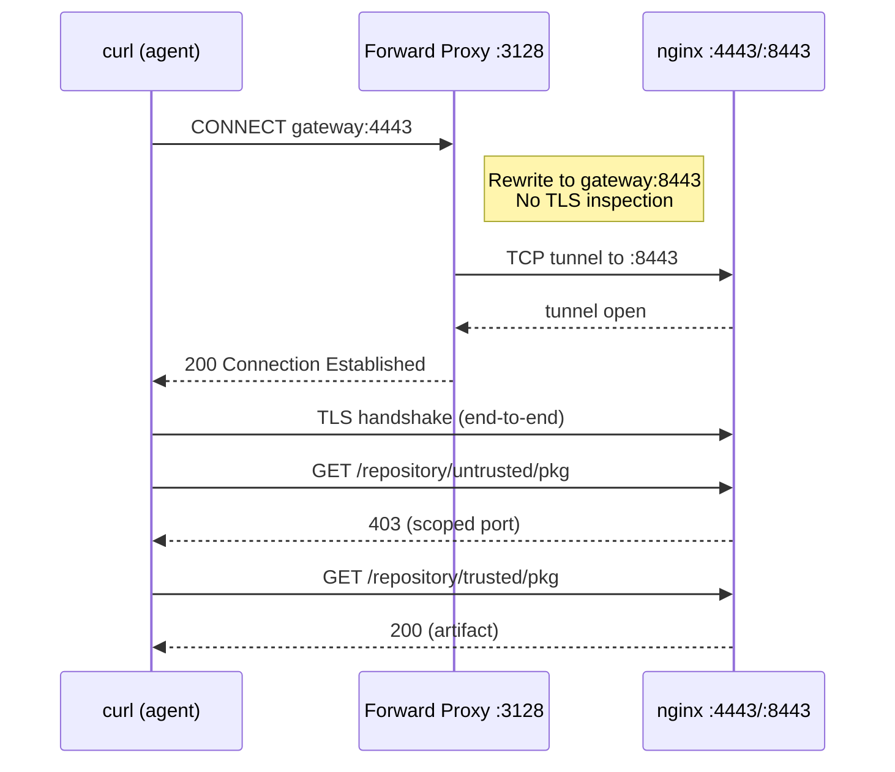

# PoC 1: HTTPS CONNECT Tunnel

[Back to overview](../README.md)

Proves the forward proxy rewrites the destination port inside a CONNECT
request without terminating or inspecting TLS.

## What it demonstrates



The proxy holds no certificates. TLS is between client and gateway.

## Running

```bash
cd 02-https-connect/
docker-compose up -d
# Wait ~90s for Nexus + init
docker logs 02-https-connect-tester-1
```

## Manual testing

```bash
CA=02-https-connect/certs/ca-cert.pem

# Human: direct HTTPS, full access
curl --cacert $CA -u admin:admin123 \
    https://localhost:34443/repository/untrusted/test-pkg.txt

# Agent via CONNECT proxy: scoped access
curl --cacert $CA -u admin:admin123 \
    -x http://localhost:3128 \
    https://gateway:4443/repository/untrusted/test-pkg.txt
# Expect: 403
```

## Files

- `certs/generate.sh`: generates CA, server cert, server key
- `nginx/gateway.conf`: HTTPS listeners on 4443 (full) and 8443 (scoped)
- `init/setup-nexus.sh`: creates trusted/untrusted repos, uploads artifacts
- `test/run-tests.sh`: 6 tests (3 scenarios x 2 repos)
