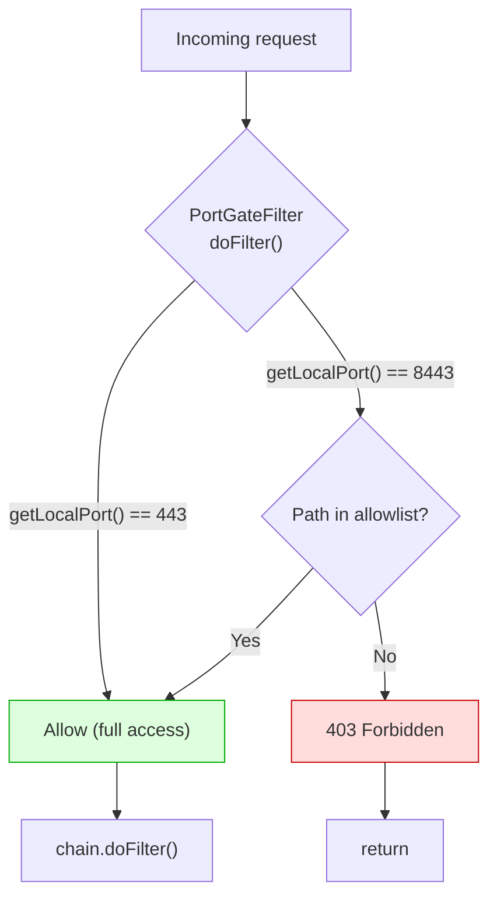

# PoC 2: Nexus Port-Gate Plugin

[Back to overview](../README.md)

Java servlet filter source code that gates repository access based on the
local TCP port. Deployable as an OSGi bundle to Nexus's `deploy/` directory.

## What it implements



## Source files

| File | Purpose |
|---|---|
| `nexus-port-gate/src/.../PortGateFilter.java` | The filter. Reads `getLocalPort()`, checks allowlist |
| `nexus-port-gate/pom.xml` | Maven build with Felix bundle plugin (OSGi) |
| `nexus-port-gate/Dockerfile.build` | Docker-based Maven build |
| `port-gate.groovy` | Groovy script version (Nexus < 3.71 only) |

## Building

```bash
cd nexus-port-gate/
docker build -f Dockerfile.build -t nexus-port-gate-builder .
docker create --name builder nexus-port-gate-builder
docker cp builder:/build/target/nexus-port-gate-plugin-1.0.0.jar .
docker rm builder
```

## Deploying

```bash
cp nexus-port-gate-plugin-1.0.0.jar $NEXUS_HOME/deploy/
# Add JVM args to nexus.vmoptions:
#   -Dnexus.portgate.scopedPort=8443
#   -Dnexus.portgate.allowed=/repository/trusted/,/repository/npm-agent/
# Restart Nexus
```

## Configuration

| JVM property | Default | Purpose |
|---|---|---|
| `nexus.portgate.scopedPort` | `8082` | Port that triggers allowlist checking |
| `nexus.portgate.allowed` | `/repository/trusted/` | Comma-separated path prefixes allowed on scoped port |

## Groovy script alternative

For Nexus < 3.71 (which still has the scripting API), `port-gate.groovy`
achieves the same result without a build step. Upload via:

```bash
curl -u admin:PASSWORD -X POST \
    http://nexus:8081/service/rest/v1/script \
    -H "Content-Type: application/json" \
    -d @script-payload.json
```

Nexus 3.71+ returns `410 Gone` for this endpoint. Use the Java plugin.
