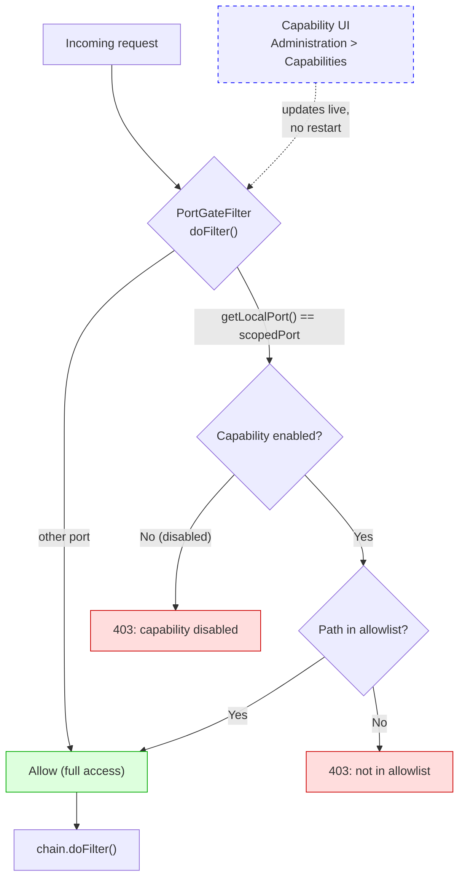

# PoC 2: Nexus Port-Gate Plugin

[Back to overview](../README.md)

Java plugin that gates repository access based on the local TCP port.
Implemented as a Nexus Capability, so the allowlist is configurable via the
Nexus UI without a restart.

## How it works



## Nexus Capability UI

After deploying and restarting, configure via:

**Administration > Capabilities > Add > Agent Trust: Port Gate**

Two form fields:

- **Scoped port**: the Nexus port that receives agent traffic. Default `8443`.
  Must match the second Jetty connector and the port the forward proxy routes
  to.

- **Allowed repository paths**: one repository path prefix per line. `#`
  comments and blank lines are ignored. A prefix matches any request URI that
  starts with that string, so `/repository/npm-internal/` covers all paths
  under that repository including nested group members.

Example configuration:

```text
# Hosted repositories: internally published artifacts, always safe
/repository/maven-releases/
/repository/maven-snapshots/

# Proxy repositories: only those with IQ Firewall + quarantine confirmed
/repository/npm-internal/
/repository/pypi-internal/
/repository/go-internal/
```

Click **Save**. Changes take effect on the next request. No restart needed.

When the capability is **disabled**, the scoped port denies all repository
access. The summary line in the capability list shows the current port and
path count, e.g. `Port-Gate: scoped port 8443, 5 allowed path(s)`.

Config is stored in the Nexus database and survives upgrades.

## Source files

| File | Purpose |
|---|---|
| `PortGateFilter.java` | Servlet filter. Reads port, checks allowlist, returns 403 or passes through |
| `PortGateConfig.java` | Thread-safe config holder. AtomicReference swap, no locking on hot path |
| `PortGateCapability.java` | Nexus Capability. Manages lifecycle, calls `PortGateConfig.update()` on config change |
| `PortGateCapabilityDescriptor.java` | Defines the UI form (scoped port field, allowed paths textarea) |
| `pom.xml` | Maven build with Felix bundle plugin (OSGi), capability/formfields deps |
| `Dockerfile.build` | Docker-based Maven build |
| `port-gate.groovy` | Groovy script for Nexus < 3.71 (scripting API removed in 3.71+) |

## Building

```bash
cd 03-plugin/nexus-port-gate/
docker build -f Dockerfile.build -t nexus-port-gate-builder .
docker create --name builder nexus-port-gate-builder
docker cp builder:/build/target/nexus-port-gate-plugin-1.0.0.jar .
docker rm builder
```

## Deploying

```bash
cp nexus-port-gate-plugin-1.0.0.jar $NEXUS_HOME/deploy/
# Restart Nexus once (initial deployment only)
# Then configure via the Capability UI, no further restarts needed
```

## Hot reloading

The filter reads config from `PortGateConfig` on every request via an
`AtomicReference<Snapshot>`. The capability calls `config.update()` when:

- The capability is created or enabled (`onActivate`)
- The config is edited and saved (`onUpdate`)
- The capability is disabled (`onDeactivate`, calls `config.clear()`)
- The capability is deleted (`onRemove`, calls `config.clear()`)

No restart, no file watch, no polling. The Nexus framework handles the event
delivery.
