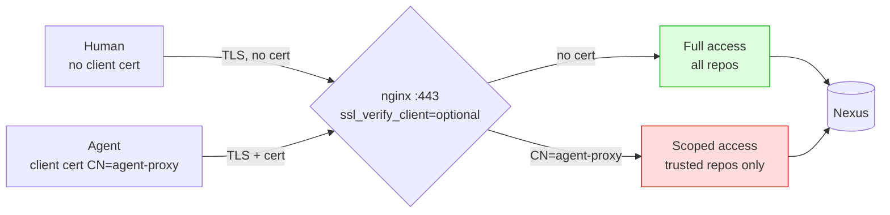

# PoC 3: mTLS Client Cert Differentiation

[Back to overview](../README.md)

Proves a single port (443) can differentiate agent from human based on the
TLS client certificate. No port routing needed.

## What it demonstrates



## Running

```bash
cd 04-mtls/
docker-compose up -d
# Wait ~90s
docker logs 04-mtls-tester-1
```

## Manual testing

```bash
CA=04-mtls/certs/ca-cert.pem
CERT=04-mtls/certs/client-cert.pem
KEY=04-mtls/certs/client-key.pem

# Human: no client cert, full access
curl --cacert $CA -u admin:admin123 \
    https://localhost:6443/repository/untrusted/test-pkg.txt
# Expect: 200

# Agent: with client cert, scoped access
curl --cacert $CA --cert $CERT --key $KEY -u admin:admin123 \
    https://localhost:6443/repository/untrusted/test-pkg.txt
# Expect: 403
```

## Files

- `certs/generate.sh`: generates CA, server cert, client cert (CN=agent-proxy)
- `nginx/gateway.conf`: mTLS config with `map $ssl_client_s_dn $is_agent`
- `test/run-tests.sh`: 6 tests across 4 scenarios

## Production equivalent

In production, Nexus/Jetty would use `needClientAuth=true` and a plugin would
read `X509Certificate[0].getSubjectX500Principal()` instead of nginx reading
`$ssl_client_s_dn`. The differentiation mechanism is identical.

## Expected output

<details>
<summary>Test suite output</summary>

```
======================================================
  PoC mTLS: Client Cert Differentiation
======================================================

  Single port 443. nginx checks client cert subject.
  CN=agent-proxy: scoped access.
  No cert: full access (human).

--- Scenario 1: HUMAN (no client cert) ---
  PASS: human reads trusted (HTTP 200)
  PASS: human reads untrusted (HTTP 200)

--- Scenario 2: AGENT (client cert CN=agent-proxy) ---
  PASS: agent reads trusted (HTTP 200)
  PASS: agent blocked from untrusted (HTTP 403)

--- Scenario 3: Cert differentiation is behavioral ---
    No cert:    HTTP 200 (human = allowed)
    With cert:  HTTP 403 (agent = blocked)
  PASS: same URL, different result by cert (HTTP yes)

--- Scenario 4: Human without cert gets untrusted ---
  PASS: no cert = human access (HTTP 200)

======================================================
  Results: 6 passed, 0 failed
======================================================
```

</details>

## Port mappings

| Host port | Container port | Purpose |
|---|---|---|
| 48081 | 8081 | Nexus UI (internal) |
| 6443 | 443 | HTTPS with optional mTLS |

## Cleaning up

```bash
docker-compose down -v
```

## Notes

- Three certs are generated: CA, server cert (CN=gateway), and client cert
  (CN=agent-proxy). All signed by the same CA.
- nginx uses `ssl_verify_client optional`, so humans without a client cert
  still get a TLS connection. The cert is optional, not required.
- The client cert differentiates the agent. The same Nexus token is used in
  both cases; the cert adds an identity layer at TLS, not at Nexus auth.
