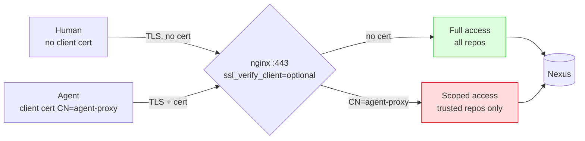

# PoC 3: mTLS Client Cert Differentiation

[Back to overview](../README.md)

Proves a single port (443) can differentiate agent from human based on the
TLS client certificate. No port routing needed.

## What it demonstrates



## Running

```bash
cd 04-mtls/
docker-compose up -d
# Wait ~90s
docker logs 04-mtls-tester-1
```

## Manual testing

```bash
CA=04-mtls/certs/ca-cert.pem
CERT=04-mtls/certs/client-cert.pem
KEY=04-mtls/certs/client-key.pem

# Human: no client cert, full access
curl --cacert $CA -u admin:admin123 \
    https://localhost:6443/repository/untrusted/test-pkg.txt
# Expect: 200

# Agent: with client cert, scoped access
curl --cacert $CA --cert $CERT --key $KEY -u admin:admin123 \
    https://localhost:6443/repository/untrusted/test-pkg.txt
# Expect: 403
```

## Files

- `certs/generate.sh`: generates CA, server cert, client cert (CN=agent-proxy)
- `nginx/gateway.conf`: mTLS config with `map $ssl_client_s_dn $is_agent`
- `test/run-tests.sh`: 6 tests across 4 scenarios

## Production equivalent

In production, Nexus/Jetty would use `needClientAuth=true` and a plugin would
read `X509Certificate[0].getSubjectX500Principal()` instead of nginx reading
`$ssl_client_s_dn`. The differentiation mechanism is identical.
