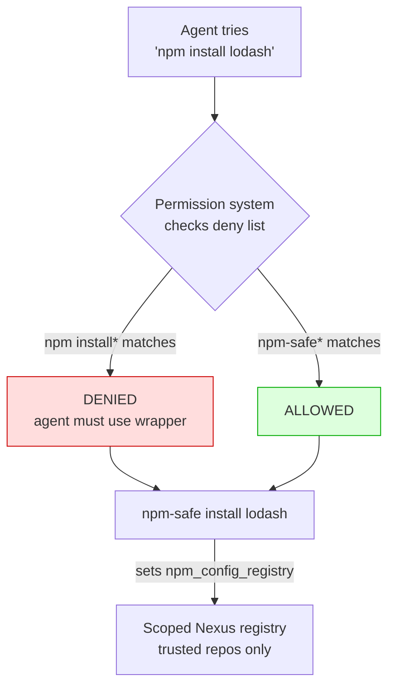

# PoC 4: Agent Wrappers + Permission Denylists

[Back to overview](../README.md)

Client-side enforcement. Wrapper scripts force the scoped registry URL.
Permission configs deny direct package installs and only allow wrappers.

## What it demonstrates



## Running

```bash
cd 05-wrappers/
docker-compose up --abort-on-container-exit
docker logs wrapper-tester
```

## Deploying to real workstations

Copy the wrapper scripts and permission configs:

```bash
# Wrappers
sudo cp wrappers/npm-safe /usr/local/bin/
sudo cp wrappers/pip-safe /usr/local/bin/
sudo cp wrappers/go-safe /usr/local/bin/
sudo chmod +x /usr/local/bin/*-safe

# opencode
mkdir -p ~/.config/opencode
cp opencode.json ~/.config/opencode/opencode.json

# Claude Code
mkdir -p ~/.claude
cp claude-settings.json ~/.claude/settings.json
```

Set the scoped registry URL:

```bash
# In the agent's environment (or wrapper defaults)
export NPM_SCOPED_REGISTRY=https://nexus.corp/repository/npm-agent/
```

## Files

- `wrappers/npm-safe`: forces `npm_config_registry` env var
- `wrappers/pip-safe`: forces `--index-url`
- `wrappers/go-safe`: forces `GOPROXY`
- `opencode.json`: permission deny/allow rules for opencode
- `claude-settings.json`: permission deny/allow rules for Claude Code
- `test/run-tests.sh`: 10 tests
- `test/mock-registry.conf`: nginx mock for testing

## Expected output

<details>
<summary>Test suite output</summary>

```
======================================================
  PoC 4: Agent Wrappers + Permission Denylists
======================================================

--- Wrapper availability ---
  PASS: npm-safe in PATH
  PASS: pip-safe in PATH
  PASS: go-safe in PATH

--- Wrapper forces scoped registry ---
  PASS: npm-safe --version works
    npm-safe registry: http://mock-registry/npm-agent/
  PASS: npm-safe uses scoped registry
    npm (direct) registry: https://registry.npmjs.org/
  PASS: direct npm does NOT use scoped

--- Scoped registry connectivity ---
  PASS: scoped registry reachable

--- Permission denylist simulation ---
  PASS: 'npm install' would be denied
  PASS: 'npm-safe install' would be allowed

--- Wrapper delegates to real binary ---
  PASS: wrapper calls real npm

======================================================
  Results: 10 passed, 0 failed
======================================================
```

</details>

## Notes

- The test container puts `wrappers/` first in `PATH`. The real `npm` is
  still available but not scoped.
- The wrapper sets `npm_config_registry` as an environment variable, which
  all npm subcommands honour (including `config get registry`).
- `pip-safe` and `go-safe` follow the same pattern with `PIP_INDEX_URL` and
  `GOPROXY` respectively.
- Permission denylists are simulated in the test. In production, opencode
  and Claude Code enforce them at the agent layer before the command reaches
  the shell.
