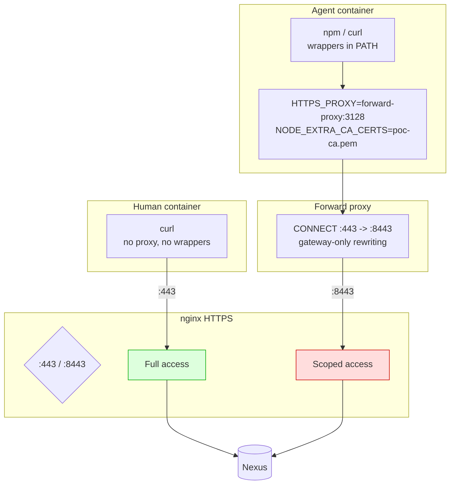

# PoC 5: Full End-to-End

[Back to overview](../README.md)

Combines all layers: HTTPS, CONNECT proxy with port rewriting, nginx gating,
agent wrappers, permission configs, and CA-based TLS validation.

## What it demonstrates



## Running

```bash
cd 06-full/
docker-compose up -d
# Wait ~90s for Nexus + init + tests

# Agent perspective (10 tests)
docker logs full-agent-tester

# Human perspective (2 tests)
docker logs full-human-tester

# Proxy logs (CONNECT rewrite proof)
docker logs full-proxy
```

## What the tests verify

| Layer | Test | What it proves |
|---|---|---|
| HTTPS CONNECT | trusted accessible via proxy | Port rewrite works |
| HTTPS CONNECT | untrusted blocked via proxy | Gating works through tunnel |
| Wrapper | npm-safe uses scoped registry | Wrapper forces correct URL |
| Wrapper | direct npm NOT scoped | Wrapper is the only scoped path |
| Permissions | opencode.json present and denies npm | Config is valid |
| Permissions | claude-settings.json present and denies npm | Config is valid |
| TLS | CA cert installed | Trust chain configured |
| TLS | cert validates (ssl_verify_result=0) | End-to-end TLS works |
| Human | trusted accessible on :443 | Human gets full access |
| Human | untrusted accessible on :443 | Human gets full access |

## Files

- `certs/`: CA, server cert (same as 02-https-connect)
- `nginx/gateway.conf`: HTTPS on :443 (full) and :8443 (scoped)
- `init/setup-nexus.sh`: repo creation + artifact upload + EULA
- `wrappers/`: npm-safe, pip-safe, go-safe (same as 05-wrappers)
- `opencode.json`, `claude-settings.json`: permission configs
- `test/run-tests.sh`: 10 agent-side tests
- `test/human-tests.sh`: 2 human-side tests
