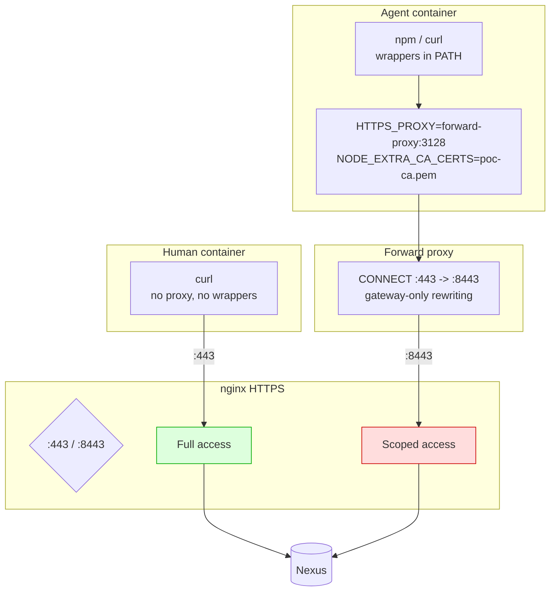

# PoC 5: Full End-to-End

[Back to overview](../README.md)

Combines all layers: HTTPS, CONNECT proxy with port rewriting, nginx gating,
agent wrappers, permission configs, and CA-based TLS validation.

## What it demonstrates



## Running

```bash
cd 06-full/
docker-compose up -d
# Wait ~90s for Nexus + init + tests

# Agent perspective (10 tests)
docker logs full-agent-tester

# Human perspective (2 tests)
docker logs full-human-tester

# Proxy logs (CONNECT rewrite proof)
docker logs full-proxy
```

## What the tests verify

| Layer | Test | What it proves |
|---|---|---|
| HTTPS CONNECT | trusted accessible via proxy | Port rewrite works |
| HTTPS CONNECT | untrusted blocked via proxy | Gating works through tunnel |
| Wrapper | npm-safe uses scoped registry | Wrapper forces correct URL |
| Wrapper | direct npm NOT scoped | Wrapper is the only scoped path |
| Permissions | opencode.json present and denies npm | Config is valid |
| Permissions | claude-settings.json present and denies npm | Config is valid |
| TLS | CA cert installed | Trust chain configured |
| TLS | cert validates (ssl_verify_result=0) | End-to-end TLS works |
| Human | trusted accessible on :443 | Human gets full access |
| Human | untrusted accessible on :443 | Human gets full access |

## Files

- `certs/`: CA, server cert (same as 02-https-connect)
- `nginx/gateway.conf`: HTTPS on :443 (full) and :8443 (scoped)
- `init/setup-nexus.sh`: repo creation + artifact upload + EULA
- `wrappers/`: npm-safe, pip-safe, go-safe (same as 05-wrappers)
- `opencode.json`, `claude-settings.json`: permission configs
- `test/run-tests.sh`: 10 agent-side tests
- `test/human-tests.sh`: 2 human-side tests

## Expected output

<details>
<summary>Agent-side test output (10 tests)</summary>

```
======================================================
  PoC 5: Full End-to-End (Agent Perspective)
======================================================

--- Layer 1: HTTPS via CONNECT proxy (port rewrite) ---
  PASS: HTTPS proxy: trusted accessible
  PASS: HTTPS proxy: untrusted blocked

--- Layer 2: Agent wrapper forces scoped registry ---
  PASS: wrapper sets scoped registry
  PASS: direct npm NOT scoped

--- Layer 3: Permission denylist configs ---
  PASS: opencode.json present
  PASS: claude-settings.json present
  PASS: opencode denies npm install
  PASS: claude denies npm install

--- Layer 4: TLS validation (CA trust) ---
  PASS: CA cert installed
  PASS: TLS cert validates

======================================================
  Agent-side results: 10 passed, 0 failed
======================================================
```

</details>

<details>
<summary>Human-side test output (2 tests)</summary>

```
======================================================
  PoC 5: Full End-to-End (Human Perspective)
======================================================

--- Human: direct HTTPS, no proxy, full access ---
  PASS: human reads trusted
  PASS: human reads untrusted

======================================================
  Human-side results: 2 passed, 0 failed
======================================================
```

</details>

<details>
<summary>Forward proxy logs</summary>

```
[forward-proxy] listening on 0.0.0.0:3128
[forward-proxy] rewrites gateway:443 -> gateway:8443
[forward-proxy] CONNECT REWRITE gateway:443 -> gateway:8443
[forward-proxy] 192.168.0.6 "CONNECT gateway:443 HTTP/1.1" 200 -
```

Note: the proxy only rewrites traffic destined for the gateway. Other HTTPS
traffic (e.g. Alpine package downloads) passes through unchanged.

</details>

## Port mappings

| Host port | Container port | Purpose |
|---|---|---|
| 443 | 443 | Full HTTPS access (human direct) |
| 58443 | 8443 | Scoped HTTPS access (agent via proxy) |
| 53128 | 3128 | Forward proxy |

## Cleaning up

```bash
docker-compose down -v
```

## Notes

- Two test containers run simultaneously: `full-agent-tester` (with proxy,
  wrappers, permission configs) and `full-human-tester` (bare curl, no
  proxy).
- The agent tester uses `node:20-alpine` because it needs `npm` for wrapper
  tests. The human tester uses plain `alpine` with curl.
- `/sbin` must be in `PATH` for `apk` to work inside the node container.
- Self-signed certs are generated by `certs/generate.sh`. Same as
  `02-https-connect`.
