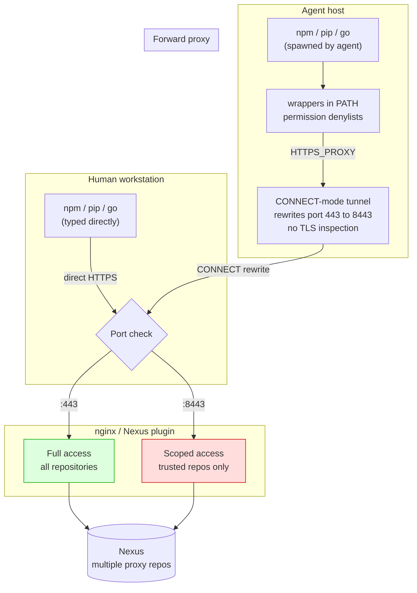
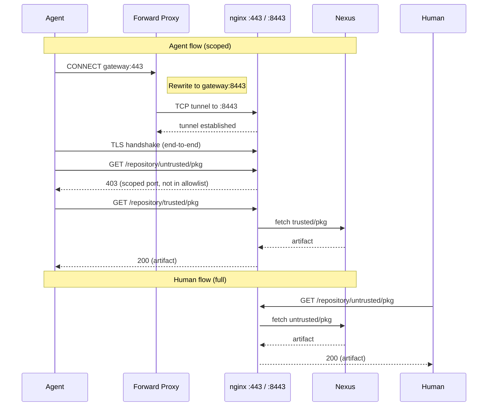
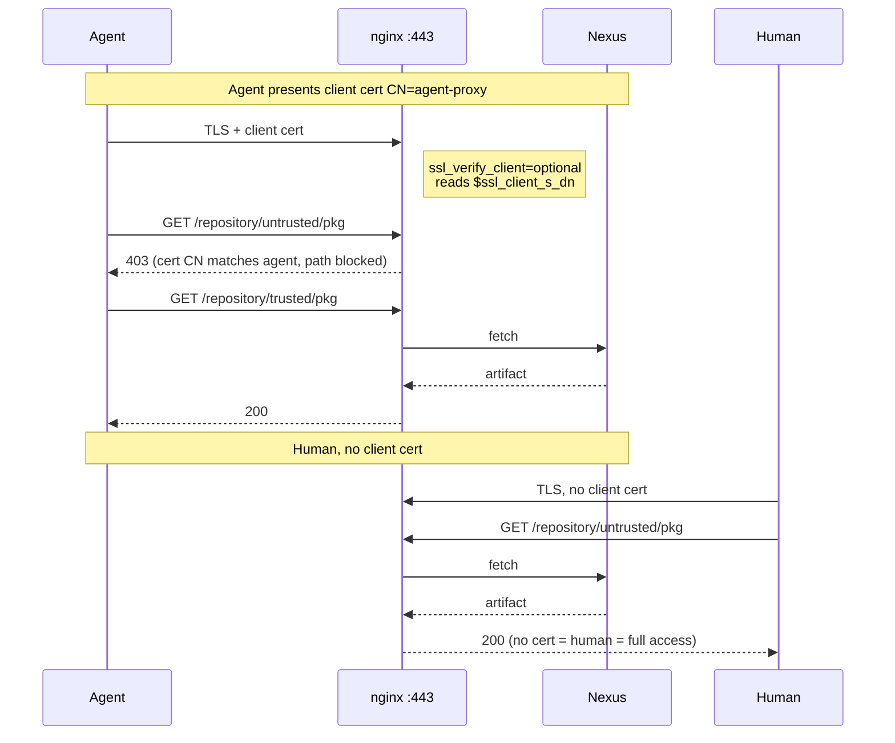

# Nexus Agent-Trust Scoping


Proof-of-concept implementations for the architecture described in
[`nexus-agent-trust-problem.md`](./nexus-agent-trust-problem.md).

## Prerequisites

- Docker 20+ and Docker Compose v2+
- `openssl` (for cert generation, usually pre-installed)
- `curl` (for manual testing)
- 4 GB free RAM (Nexus is Java)
- Ports 443, 18081, 28080, 28082, 34443, 38443, 53128, 58443, 6443 available on the host (see [TROUBLESHOOTING.md](./TROUBLESHOOTING.md) for port conflicts)

## Table of contents

- [The problem](#the-problem)
- [Architecture](#architecture)
- [Repository contents](#repository-contents)
- [Quick start](#quick-start)
- [Test results](#test-results)
- [Operations](#operations)
- [Cleaning up](#cleaning-up)
- [Troubleshooting](#troubleshooting)

## The problem

Multiple Nexus instances, each proxying many upstream package registries. We
trust some of those registries; we do not trust all of them. AI coding agents
(Claude Code, opencode) run package managers as subprocesses of the user's
shell, inheriting the user's identity and network access. We want agents to
reach all Nexus instances but only the subset of proxied repositories we
consider safe, without issuing a second credential or performing TLS
interception.

The recommended architecture: **destination port routing**. Nexus listens on
two ports with the same certificate. A forward proxy rewrites the destination
port for agent traffic. A Nexus plugin (or nginx stand-in for PoC purposes)
gates repository access based on which port the request arrived on.

## Architecture

### High-level topology



### Request flow: agent vs human



### mTLS alternative: single port, cert-based differentiation



## Repository contents

| Directory | Description | Tests |
|---|---|---|
| [`nexus-agent-trust-problem.md`](./nexus-agent-trust-problem.md) | Technical paper | |
| [`01-http-baseline/`](./01-http-baseline/) | PoC 0: HTTP baseline | 6 |
| [`02-https-connect/`](./02-https-connect/) | PoC 1: HTTPS CONNECT tunnel | 6 |
| [`03-plugin/`](./03-plugin/) | PoC 2: Nexus plugin source + build | |
| [`04-mtls/`](./04-mtls/) | PoC 3: mTLS client cert differentiation | 6 |
| [`05-wrappers/`](./05-wrappers/) | PoC 4: Agent wrappers + denylists | 10 |
| [`06-full/`](./06-full/) | PoC 5: Full end-to-end | 12 |

## Quick start

Each PoC is self-contained. Pick one, enter its directory, run docker-compose.

<details>
<summary><b>PoC 0: HTTP baseline</b> (6 tests)</summary>

The simplest demonstration. HTTP (not HTTPS), nginx gating on two ports,
forward proxy with port rewriting.

```bash
cd 01-http-baseline/
docker-compose up -d
# Wait ~90s for Nexus to boot and init to complete
docker logs poc-tester
```

Tests: human gets full access on port 8080, agent via proxy gets scoped
access on port 8082 (untrusted repos return 403).

</details>

<details>
<summary><b>PoC 1: HTTPS CONNECT tunnel</b> (6 tests)</summary>

Proves the forward proxy rewrites the destination port inside a CONNECT
request without terminating or inspecting TLS. Self-signed CA and server
cert generated via openssl.

```bash
cd 02-https-connect/
docker-compose up -d
# Wait ~90s
docker logs 02-https-connect-tester-1
docker logs https-proxy   # see CONNECT REWRITE lines
```

The proxy holds no certificates. The TLS session is end-to-end between
client and nginx gateway. The proxy only modified the TCP destination port.

</details>

<details>
<summary><b>PoC 2: Nexus plugin</b> (source + build)</summary>

Java servlet filter source code (`PortGateFilter.java`) that reads
`ServletRequest.getLocalPort()` and gates repository access. Includes:

- `nexus-port-gate/src/...PortGateFilter.java`: the filter, deployable as an
  OSGi bundle
- `nexus-port-gate/pom.xml`: Maven build with Felix bundle plugin
- `nexus-port-gate/Dockerfile.build`: Docker-based Maven build
- `port-gate.groovy`: Groovy script version (works on Nexus < 3.71; 3.93
  removed the scripting API)

To build and deploy:

```bash
cd 03-plugin/nexus-port-gate/
docker build -f Dockerfile.build -t nexus-port-gate-builder .
docker create --name builder nexus-port-gate-builder
docker cp builder:/build/target/nexus-port-gate-plugin-1.0.0.jar .
docker rm builder
# Copy to your Nexus instance:
cp nexus-port-gate-plugin-1.0.0.jar $NEXUS_HOME/deploy/
# Restart Nexus, configure via JVM args:
# -Dnexus.portgate.scopedPort=8443
# -Dnexus.portgate.allowed=/repository/trusted/,/repository/npm-agent/
```

</details>

<details>
<summary><b>PoC 3: mTLS client cert differentiation</b> (6 tests)</summary>

Proves that a single port (443) can differentiate agent from human based on
the TLS client certificate. No port routing needed. nginx checks
`$ssl_client_s_dn` and applies scoped policy when `CN=agent-proxy` is
presented.

```bash
cd 04-mtls/
docker-compose up -d
# Wait ~90s
docker logs 04-mtls-tester-1
```

Same port, same server cert, same Nexus token. The client cert is the only
differentiator. In production, Nexus/Jetty would use `needClientAuth=true`
and a plugin would read the cert subject.

</details>

<details>
<summary><b>PoC 4: Agent wrappers + permission denylists</b> (10 tests)</summary>

Client-side enforcement. Wrapper scripts force the scoped registry URL.
Permission configs (opencode and Claude Code) deny direct `npm install` and
only allow the wrapper variants.

```bash
cd 05-wrappers/
docker-compose up --abort-on-container-exit
docker logs wrapper-tester
```

Files you would deploy to real workstations:

- `wrappers/npm-safe`, `wrappers/pip-safe`, `wrappers/go-safe`: copy to
  `/usr/local/bin/`
- `opencode.json`: copy to `~/.config/opencode/opencode.json`
- `claude-settings.json`: copy to `~/.claude/settings.json`

</details>

<details>
<summary><b>PoC 5: Full end-to-end</b> (12 tests)</summary>

Combines all layers: HTTPS, CONNECT proxy with port rewriting, nginx gating,
agent wrappers, permission configs, and CA-based TLS validation. Runs two
separate test containers simulating the agent perspective (with proxy and
wrappers) and the human perspective (direct access, no restrictions).

```bash
cd 06-full/
docker-compose up -d
# Wait ~90s
docker logs full-agent-tester    # 10 tests, agent perspective
docker logs full-human-tester    # 2 tests, human perspective
docker logs full-proxy           # CONNECT REWRITE proof
```

</details>

## Test results

| PoC | Description | Tests | Result |
|---|---|---|---|
| 0 | HTTP baseline | 6 | All pass |
| 1 | HTTPS CONNECT tunnel | 6 | All pass |
| 2 | Nexus plugin source | Build artifact | Source + Maven build included |
| 3 | mTLS client cert differentiation | 6 | All pass |
| 4 | Agent wrappers | 10 | All pass |
| 5 | Full end-to-end | 12 | All pass |
| | **Total** | **40** | **All pass** |

<details>
<summary>Sample output: PoC 5 agent-side tests</summary>

```
======================================================
  PoC 5: Full End-to-End (Agent Perspective)
======================================================

--- Layer 1: HTTPS via CONNECT proxy (port rewrite) ---
  PASS: HTTPS proxy: trusted accessible
  PASS: HTTPS proxy: untrusted blocked

--- Layer 2: Agent wrapper forces scoped registry ---
  PASS: wrapper sets scoped registry
  PASS: direct npm NOT scoped

--- Layer 3: Permission denylist configs ---
  PASS: opencode.json present
  PASS: claude-settings.json present
  PASS: opencode denies npm install
  PASS: claude denies npm install

--- Layer 4: TLS validation (CA trust) ---
  PASS: CA cert installed
  PASS: TLS cert validates

======================================================
  Agent-side results: 10 passed, 0 failed
======================================================
```

</details>

<details>
<summary>Sample output: PoC 5 proxy logs (CONNECT rewrite)</summary>

```
[forward-proxy] listening on 0.0.0.0:3128
[forward-proxy] rewrites gateway:443 -> gateway:8443
[forward-proxy] 192.168.0.6 "CONNECT dl-cdn.alpinelinux.org:443 HTTP/1.1" 200 -
[forward-proxy] CONNECT REWRITE gateway:443 -> gateway:8443
[forward-proxy] 192.168.0.6 "CONNECT gateway:443 HTTP/1.1" 200 -
```

Note: the proxy only rewrites traffic destined for the gateway. Other HTTPS
traffic (e.g. Alpine package downloads) passes through unchanged.

</details>

## Operations

### Makefile commands

```bash
make help           # show available commands
make up POC=06-full    # start a specific PoC
make down POC=06-full  # stop and remove volumes
make test POC=06-full  # show test output
make status         # show which PoCs are running
make clean          # stop all PoCs
make certs          # regenerate self-signed certs
make all            # run all PoCs sequentially
```

### Forward proxy

All PoCs share the same Python forward proxy (`01-http-baseline/forward-proxy/proxy.py`).
It handles both plain HTTP (URL rewriting) and HTTPS (CONNECT tunneling with
destination port rewriting). No TLS inspection occurs.

<details>
<summary>Proxy configuration</summary>

The proxy is configurable via environment variables:

| Variable | Default | Purpose |
|---|---|---|
| `FULL_PORT` | `8080` | The human port (rewritten target) |
| `SCOPED_PORT` | `8082` | The agent port (rewrite destination) |

The proxy only rewrites traffic destined for the `gateway` hostname. All
other HTTPS traffic passes through the CONNECT tunnel unchanged.

</details>

<details>
<summary>Self-signed certificates</summary>

PoCs 1, 3, and 5 use self-signed certificates generated by
`certs/generate.sh`. The CA cert (`ca-cert.pem`) must be installed in the
client's trust store for TLS validation. In production, Nexus would use a
real certificate and this step would not be needed.

The mTLS PoC (PoC 3) also generates a client cert (`client-cert.pem`,
`CN=agent-proxy`) signed by the same CA.

</details>

## Cleaning up

```bash
cd 06-full/        # or 02-https-connect/, 01-http-baseline/, etc.
docker-compose down -v --remove-orphans
```

## Troubleshooting

See [`TROUBLESHOOTING.md`](./TROUBLESHOOTING.md) for common issues including
port conflicts, Nexus EULA errors, certificate problems, and the scripting
API removal in Nexus 3.71+.

## References

- Technical paper: [`nexus-agent-trust-problem.md`](./nexus-agent-trust-problem.md)
- Nexus plugin SDK: https://github.com/sonatype/nexus-public
- opencode config schema: https://opencode.ai/config.json
- Claude Code permissions: https://docs.claude.com/en/docs/claude-code/settings
