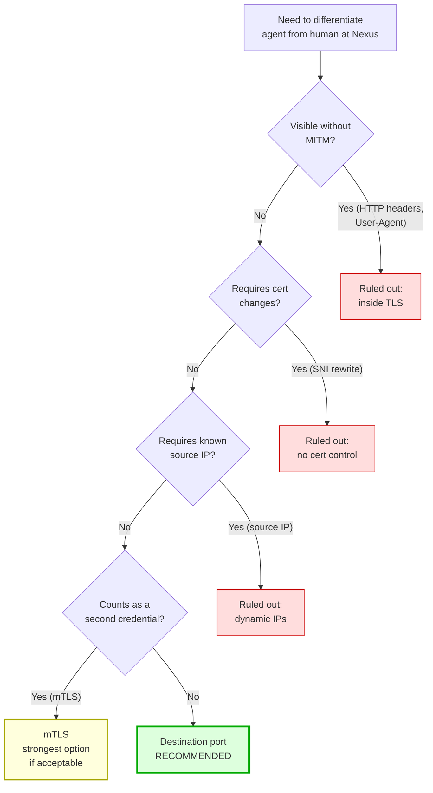
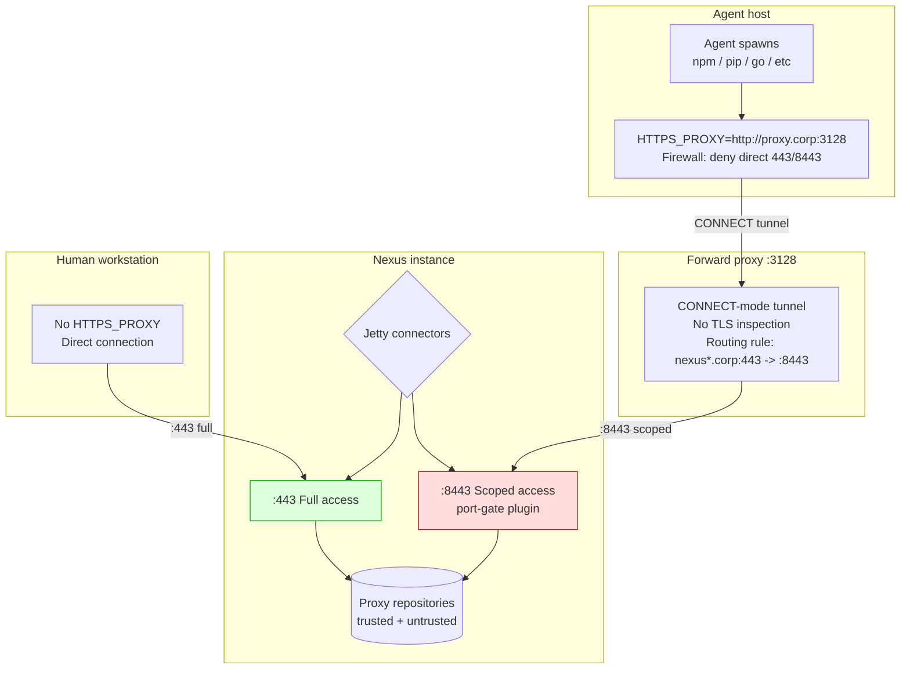
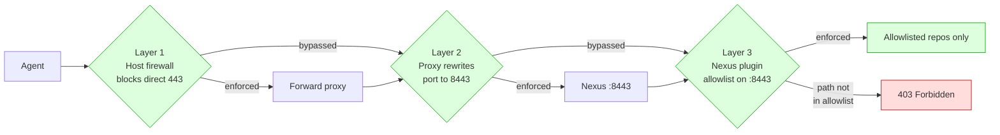

# Trust Scoping for AI Agents Across Multiple Nexus Instances

## Table of contents

- [TL;DR](#tldr)
- [1. The Problem](#1-the-problem)
- [2. Background](#2-background)
- [3. Constraints](#3-constraints)
- [4. The Fundamental Issue](#4-the-fundamental-issue-identity-is-not-intent)
- [5. Approaches Considered](#5-approaches-considered)
- [6. Recommended Architecture](#6-recommended-architecture)
- [7. Implementation Sketch](#7-implementation-sketch)
- [8. Limitations and Open Questions](#8-limitations-and-open-questions)
- [9. Production Hardening Checklist](#9-production-hardening-checklist)
- [10. Conclusion](#10-conclusion)
- [Appendix A: Pros and Cons by Approach](#appendix-a-pros-and-cons-by-approach)
- [Appendix B: Decision Matrix](#appendix-b-decision-matrix)
- [Appendix C: References](#appendix-c-references)

---

## TL;DR

We operate multiple Sonatype Nexus Repository instances. Each instance proxies many upstream package registries (npm, PyPI, Go, Docker, Maven, etc.). We trust some of those upstream sources; we do not trust all of them. We want users, and especially AI coding agents acting on behalf of users, to reach every Nexus instance, but only the subset of proxied repositories we consider safe. We cannot reliably distinguish human-driven requests from agent-driven requests at the server. Why that distinction is hard, what the options are, and why port-based routing with a Nexus-side policy plugin fits our constraints best: that follows.

---

## 1. The Problem

### 1.1 What we have

- Multiple Nexus instances, all HTTPS, distributed across environments.
- Each instance hosts many proxy repositories pointing at upstream package sources: public registries (npmjs.com, pypi.org, docker.io, proxy.golang.org), internal mirrors, vendor feeds, community mirrors, etc.
- Each user has one personal Nexus token, used by their tools (npm, pip, go, cargo, mvn, docker) to download artifacts.
- Users work both directly (typing commands themselves) and through AI coding agents (Claude Code, opencode, and similar tools that spawn shell commands on the user's behalf).

### 1.2 What we do not trust

Not every upstream registry is equally trustworthy. Some proxy repositories on each Nexus instance pull from sources we are not comfortable with:

- Unmoderated public registries with active typosquatting and malicious-package problems.
- Vendor feeds with inconsistent security practices.
- Community mirrors that have been compromised historically.
- Experimental or legacy proxies that should not be consumed by new work.

A human typing `npm install` has judgement about which sources to trust in which context. An AI agent running `npm install` does not. It executes whatever the task requires, against whatever registry the environment points it at.

### 1.3 What we want

- Every Nexus instance reachable. Agents and humans should be able to use any instance.
- Only some proxied projects/paths within each instance. Not every proxy repository on a given instance should be consumable by agent-driven installs.
- No dedicated agent token. Users have one identity. The agent acts as the user, with the user's credentials.
- No SSL certificate control. We cannot reissue Nexus certificates or add new SANs.
- No reliable source IP information. Clients come from dynamic, unpredictable networks (VPN, home office, cloud, CI).
- Real enforcement, where possible. Configuration that an agent can silently rewrite is not acceptable as a security boundary.

### 1.4 What makes this hard

The agent does not have its own network stack. It spawns `npm`, `pip`, `go`, `cargo`, `docker`, etc. as subprocesses of the user's shell. From the network's perspective, the agent is the user. Same UID, same environment variables, same source IP, same Nexus token, same TLS session. There is no field in any HTTPS request that distinguishes "Alice typed this" from "Claude Code typed this for Alice." npm sends its own `User-Agent: npm/10.x` regardless of who invoked it.

Server-side differentiation between human and agent traffic is not possible on a single user identity without adding a second signal somewhere outside the encrypted request.

---

## 2. Background

### 2.1 Sonatype Nexus Repository

Nexus is an artifact repository manager. It supports:

- Proxy repositories: cache artifacts from upstream registries (npmjs.com, pypi.org, etc.).
- Hosted repositories: store internally published artifacts.
- Group repositories: combine multiple proxy/hosted repos under one URL, presenting a merged view.
- RBAC: users, roles, privileges scoped per repository.
- Plugins: Java extensions that hook into the request filter chain, authentication, and storage layers.

Nexus runs on Eclipse Jetty. Its TLS configuration lives in `etc/jetty-https.xml`. It can listen on multiple ports with independent connectors but a shared `SslContextFactory`.

### 2.2 AI coding agents

Tools like Claude Code and opencode are LLM-driven shells. They receive instructions, decide what commands to run, and execute them via the user's shell. Both have permission systems that can deny or allow specific bash commands, but these are client-side controls that the agent itself enforces. They are not visible to the network.

Agents do not have their own package managers, HTTP clients, or network identities. They reuse whatever the environment provides.

### 2.3 The trust boundary

In a traditional environment, the trust boundary is the user: anything Alice can do, Alice's tools can do. When Alice's tools include an LLM that can be prompted to do arbitrary things, this model breaks down. The agent inherits Alice's full authority, including access to every Nexus repository Alice can read. There is no narrower scope for "Alice via agent" because the server has no way to know Alice is operating through an agent.

This document is about drawing that narrower scope without changing the identity model.

---

## 3. Constraints

The solution must respect all of the following:

| Constraint | Implication |
|---|---|
| One token per user, used by both human and agent | Nexus sees one identity; cannot apply different RBAC per mode |
| Cannot MITM HTTPS | No proxy can read paths, headers, or bodies inside TLS |
| No control over Nexus TLS certificates | Cannot add new SANs, cannot reissue for new hostnames |
| Client IPs are dynamic and unknown | Source-IP filtering is not viable |
| Multiple Nexus instances, all must be reachable | Solutions must scale across instances |
| Some proxied repos trusted, others not, per instance | Scoping must be path/repo-level, not hostname-level |
| AI agents should be scoped; humans should not | The differentiation signal must come from outside the encrypted request |

The last constraint is the crux. Every other constraint narrows the option space, but the requirement to differentiate human from agent at all is what makes the problem non-trivial.

---

## 4. The Fundamental Issue: Identity is not Intent

Nexus authenticates requests by identity (the token's user) and authorizes by role membership (which privileges that user has). It has no concept of intent. The same identity can be acting deliberately (human) or being driven by an LLM (agent). Without a way to express intent, RBAC alone cannot scope agent traffic differently from human traffic for the same user.

Adding intent requires injecting a signal that survives end-to-end TLS and is verifiable at Nexus. The only signals that fit are:



1. Source IP: visible at TCP layer, but ruled out by dynamic IPs.
2. SNI / destination hostname: visible at TLS handshake, but requires certificate coverage we don't have.
3. Destination port: visible at TCP layer, controllable from the client/proxy, requires no certificate changes.
4. Client certificate (mTLS): visible at TLS handshake, identifies client independent of IP, but counts as a second credential.
5. HTTP headers: invisible inside TLS without MITM, ruled out.
6. User-Agent: set by the tool (npm, pip), not the parent process; identical for human and agent.
7. PROXY protocol headers: visible before TLS bytes, but requires support on both ends and a front layer that reads them.

Of these, destination port is the only signal that satisfies every constraint in section 3. The rest are either invisible without MITM, ruled out by certificate constraints, or require credentials we have declined to issue.

---

## 5. Approaches Considered

### 5.1 Client-side configuration (env vars, `.npmrc`)

Point agent environments at scoped Nexus group URLs containing only trusted proxies.

Verdict: Defaults, not enforcement. The agent inherits the environment but can rewrite `.npmrc`, change `--registry` flags, or `unset HTTPS_PROXY`. Suitable for "sensible defaults," unsuitable as a security boundary.

### 5.2 Nexus RBAC with dedicated agent tokens

Issue each user a second token tied to a scoped role; configure the agent environment to use it.

Verdict: Real enforcement. Ruled out by the "one token per user" constraint.

### 5.3 Custom HTTP header set by the agent

Have agents send `X-Client-Type: agent`; Nexus plugin reads it and applies policy.

Verdict: Two problems. First, the agent doesn't set HTTP headers. npm, pip, and friends do, and they don't know they were invoked by an agent. Second, even if injected via env config, the header is forgeable. Not enforcement.

### 5.4 Forward proxy with MITM (SSL-Bump)

Terminate TLS at a proxy, inspect paths, apply policy, re-encrypt to Nexus.

Verdict: Real enforcement with full path visibility. Ruled out by the no-certificate constraint. MITM requires installing a proxy CA into every tool's trust store, which we cannot do without certificate issuance authority.

### 5.5 Source IP filtering at Nexus

Identify agent traffic by the source IP of the connection.

Verdict: Sound mechanism (visible at TCP layer, no MITM needed). Ruled out by dynamic client IPs. VPN, remote workers, CI runners, and cloud egress make source IPs unpredictable.

### 5.6 SNI rewriting

Rewrite the TLS Server Name Indication field at the proxy to a sentinel value (e.g., `nexus-agent.corp`); Nexus plugin reads SNI and applies policy.

Verdict: Technically clean. Ruled out by the certificate constraint. Nexus's cert must be valid for the rewritten SNI value, and we cannot reissue.

### 5.7 Mutual TLS (client certificate)

Nexus requires a client certificate; the proxy presents one with CN `agent-proxy`; Nexus plugin applies scoped policy based on cert subject.

Verdict: Real enforcement, IP-agnostic, scales cleanly. The only objection is philosophical: a client cert is technically a credential. If "no second credential" is a hard rule, this is excluded. If "no Nexus-issued access token" is the actual rule, mTLS qualifies and is the strongest option.

### 5.8 Destination port routing

Nexus listens on two ports (e.g., 443 and 8443) with the same certificate. A Nexus plugin applies scoped policy on 8443. The forward proxy always connects to 8443 on behalf of agent traffic.

Verdict: Real enforcement, IP-agnostic, no certificate changes, no second credential, scales across instances with a portable plugin. Recommended.

### 5.9 mTLS client certificate differentiation (single port)

Nexus (or nginx in front) is configured with `ssl_verify_client=optional` on a single port. Clients that present a certificate with `CN=agent-proxy` get scoped access. Clients without a cert get full access. A Nexus plugin reads the certificate subject from the TLS session.

Verdict: Real enforcement, IP-agnostic, no port routing needed, works on a single port. The client certificate is technically a second credential, but it is not a Nexus access token. It lives at the TLS layer. See [PoC 3](04-mtls/) for a working demonstration.

---

## 6. Recommended Architecture

### 6.1 Topology



### 6.2 Why this satisfies every constraint

| Constraint | How port routing satisfies it |
|---|---|
| One token per user | Same Nexus token used on both ports; identity unchanged |
| No MITM | Proxy operates in CONNECT mode; TLS is end-to-end between client and Nexus |
| No cert changes | Same `SslContextFactory` serves both ports; cert is reused |
| Dynamic client IPs | The signal is destination port, not source IP |
| All instances reachable | Each instance runs the same plugin and dual-port connector |
| Per-instance path scoping | Plugin's allowlist is configurable per instance |
| Differentiation of agent vs human | Proxy always uses 8443; humans use 443 directly |

### 6.3 Enforcement layers (defense in depth)

The architecture has three enforcement points. Any one failing does not compromise the others:



1. Host firewall: denies the agent host direct access to Nexus on any port. Forces all traffic through the forward proxy. Without this, the agent can bypass by unsetting `HTTPS_PROXY`.
2. Proxy port rewriting: ensures any traffic reaching Nexus from the proxy lands on 8443. The signal Nexus differentiates on.
3. Nexus plugin: applies the actual allowlist. Even if the firewall and proxy are bypassed, the plugin will only allow certain paths when the connection arrives on 8443.

A fourth, optional layer hardens the agent side:

4. Agent permission denylists: Claude Code and opencode support denying specific bash commands (e.g., `Bash(npm install*)`). Pairing this with wrapper scripts (e.g., `npm-safe` that hard-codes the scoped registry URL) gives the agent a sensible default and catches accidental bypass even when the network layers are not in play (e.g., a developer running the agent on an unprotected network).

### 6.4 Why other approaches were rejected

- Client-side config alone (5.1) is bypassable by the agent itself. Useful as a default, useless as a boundary.
- Dedicated agent tokens (5.2) would solve this cleanly but violate the one-token-per-user constraint.
- Custom headers (5.3) are either absent (npm sets its own User-Agent) or forgeable. Not a boundary.
- MITM proxies (5.4) require a certificate authority we do not control.
- Source IP filtering (5.5) fails on dynamic client networks.
- SNI rewriting (5.6) requires a cert covering the sentinel hostname.
- mTLS (5.7) is the next-best option if port routing is not viable. It is stronger in some respects (works regardless of network topology) but introduces a credential that violates the literal "no second credential" rule.

---

## 7. Implementation Sketch

### 7.1 Nexus: add a second Jetty connector

Edit `$NEXUS_HOME/etc/jetty-https.xml` (or create `etc/jetty-https-scoped.xml`) to add a second `ServerConnector` bound to port 8443, sharing the existing `SslContextFactory`.

### 7.2 Nexus: deploy a port-gate plugin

A small Java plugin (~80 lines) registers a servlet `Filter` that:

1. Reads `ServletRequest.getLocalPort()`.
2. If the port is the scoped port (8443), checks the request URI against a configurable allowlist of repository path prefixes.
3. Returns HTTP 403 for any path outside the allowlist.
4. Passes through otherwise.

The allowlist is loaded from a config file (`etc/scoped-repos.conf`) or from a Nexus capability, allowing per-instance customization without code changes.

### 7.3 Forward proxy: rewrite destination port

Configuration varies by proxy software. Examples:

- Squid: `cache_peer` directive pointing at port 8443 for Nexus destinations.
- mitmproxy: script hooking `next_layer` or `server_connect` to rewrite the destination port.
- HAProxy (TCP mode): `backend` block with `server nexus-scoped nexus.corp:8443`.

In all cases, the proxy performs no TLS inspection. It opens a TCP tunnel; the TLS session passes through unchanged.

### 7.4 Agent host: firewall and env

- `HTTPS_PROXY=http://proxy.corp:3128` in the agent's environment.
- Host firewall (iptables/nftables/firewalld) denies outbound 443 and 8443 to `*.nexus.corp` from the agent's user context.
- Optionally, OS-level network namespace isolation for the agent process, ensuring it cannot reach Nexus directly at all.

### 7.5 Agent (optional hardening): permission denylists and wrappers

<details>
<summary>Claude Code config (<code>~/.claude/settings.json</code>)</summary>

```json
{
  "permissions": {
    "deny": [
      "Bash(npm install*)", "Bash(npm i *)", "Bash(npm ci*)",
      "Bash(pip install*)", "Bash(pip3 install*)",
      "Bash(go install*)", "Bash(go get*)", "Bash(go mod download*)",
      "Bash(cargo add*)", "Bash(cargo install*)", "Bash(cargo build*)",
      "Bash(docker pull*)", "Bash(docker run*)", "Bash(docker build*)"
    ],
    "allow": [
      "Bash(npm-safe*)", "Bash(pip-safe*)", "Bash(go-safe*)",
      "Bash(cargo-safe*)", "Bash(docker-safe*)"
    ]
  }
}
```

</details>

<details>
<summary>opencode config (<code>~/.config/opencode/opencode.json</code>)</summary>

```json
{
  "$schema": "https://opencode.ai/config.json",
  "permission": {
    "bash": {
      "*": "ask",
      "npm install*": "deny",
      "npm i *": "deny",
      "npm ci*": "deny",
      "pip install*": "deny",
      "go install*": "deny",
      "go get*": "deny",
      "docker pull*": "deny",
      "npm-safe*": "allow",
      "pip-safe*": "allow",
      "go-safe*": "allow",
      "docker-safe*": "allow"
    }
  }
}
```

</details>

<details>
<summary>Wrapper script example (<code>/usr/local/bin/npm-safe</code>)</summary>

```bash
#!/bin/sh
export npm_config_registry=https://nexus.corp:8443/repository/npm-agent-group/
exec /usr/bin/npm "$@"
```

</details>

This client-side layer is not the primary enforcement. The firewall, proxy, and plugin are. But it catches accidental bypasses and provides defense in depth on networks where the host firewall is not in effect.

---

## 8. Limitations and Open Questions

### 8.1 Trust in the host firewall

The architecture's enforcement strength equals the strength of the agent host's firewall. If the agent runs on a developer laptop that the developer controls, they can disable the firewall and bypass the proxy. This is acceptable if the threat model is "prevent the agent from doing the wrong thing by default" rather than "prevent a malicious user from exfiltrating packages." For a stronger boundary, the agent must run in a context the user does not control (managed workstation, container, VM).

### 8.2 Coverage of non-proxy tools

The plugin scopes HTTP requests to `/repository/*`. Tools that bypass Nexus entirely (curl, wget, direct git clones from GitHub) are unaffected. If the goal is to prevent the agent from reaching untrusted sources in general, network egress controls are needed in addition to Nexus-side scoping.

### 8.3 Docker and daemon-driven tools

Docker pulls go through the daemon, not the CLI. The CLI sends an image name; the daemon resolves the registry. A wrapper around `docker` cannot reliably scope pulls. For Docker specifically, the cleanest enforcement is daemon-level registry mirror configuration combined with egress firewall rules denying direct access to public container registries.

### 8.4 Multiple instances, multiple plugin versions

Each Nexus instance needs the plugin installed and configured. If instances run different Nexus versions, plugin compatibility must be verified across all of them. A canonical build pipeline for the plugin is recommended.

### 8.5 Auditing

The plugin should log every scoped-port request and every 403. These logs are the audit trail for "what did the agent try to install," useful for incident response and for tuning the allowlist over time.

### 8.6 The mTLS question

If at any point the "no second credential" constraint can be relaxed to "no Nexus-issued access token," mTLS becomes available and is strictly stronger than port routing. It works regardless of network topology, does not require a forward proxy, and identifies the source cryptographically rather than by network convention. The port-routing architecture should be designed so that mTLS can be layered on later without rearchitecting the plugin.

---

## 9. Production Hardening Checklist

Before deploying the port-routing architecture to production:

<details>
<summary><b>Network layer</b></summary>

- [ ] Forward proxy deployed and configured to rewrite gateway traffic to the scoped port
- [ ] Host firewall on agent workstations denies direct 443/8443 to Nexus FQDNs
- [ ] DNS resolves Nexus FQDNs correctly from both agent and human networks
- [ ] Egress firewall blocks direct access to public package registries (npmjs.com, pypi.org, etc.)
- [ ] Proxy health checks and failover configured

</details>

<details>
<summary><b>Nexus layer</b></summary>

- [ ] Jetty configured with two connectors (443 full, 8443 scoped) sharing the same `SslContextFactory`
- [ ] Port-gate plugin deployed to `$NEXUS_HOME/deploy/` on every instance
- [ ] Plugin allowlist configured per instance via JVM properties
- [ ] Plugin logs every scoped-port request and every 403
- [ ] Nexus RBAC unchanged: same token works on both ports
- [ ] Nexus cert valid for the instance FQDN (no additional SANs needed)

</details>

<details>
<summary><b>Agent layer</b></summary>

- [ ] `HTTPS_PROXY` set in agent environment pointing to the forward proxy
- [ ] Wrapper scripts (`npm-safe`, `pip-safe`, `go-safe`) installed in PATH
- [ ] opencode permission config deployed (`~/.config/opencode/opencode.json`)
- [ ] Claude Code permission config deployed (`~/.claude/settings.json`)
- [ ] CA cert installed in agent trust store if using self-signed certs (not needed with real certs)

</details>

<details>
<summary><b>Future-proofing</b></summary>

- [ ] mTLS designed as a drop-in upgrade path (plugin can read cert subject if port routing is later replaced)
- [ ] Plugin build pipeline established for Nexus version upgrades
- [ ] Allowlist review process documented (who can add a repo to the trusted list)
- [ ] Incident response runbook: what to do when an agent install is blocked
- [ ] Monitoring: alert on unexpected 403 volume from the scoped port

</details>

---

## 10. Conclusion

The problem reduces to a single hard fact: the server cannot tell human from agent on the same identity, so intent must be encoded in a signal outside the encrypted request. Of the signals available without MITM, certificate changes, source IP information, or a second credential, destination port is the only one that satisfies every constraint.

The recommended architecture uses port-based routing as the primary signal, with a Nexus-side plugin as the policy enforcement point, a forward proxy to ensure agent traffic lands on the scoped port, and a host firewall to prevent bypass. Client-side agent permission denylists and wrapper scripts provide defense in depth and a sensible default behavior on networks where the full architecture is not in effect.

This is not the only possible architecture. mTLS is a stronger alternative if a transport-layer credential is acceptable. Source IP filtering is simpler if client IPs are stable. MITM gives full path visibility if a proxy CA can be deployed. Port routing is the right answer for the specific set of constraints documented in section 3, and those constraints should be revisited periodically, because relaxing any one of them unlocks a cleaner solution.

---

## Appendix A: Pros and Cons by Approach

<details>
<summary><b>A.1 Client-side configuration (env vars, <code>.npmrc</code>)</b></summary>

Pros:
- Zero infrastructure changes. Works today with stock Nexus and stock tools.
- Per-tool granularity (npm, pip, go, etc. can each point at different scoped group repos).
- Easy to roll out incrementally; no coordination between teams.
- Useful as a "sensible defaults" layer even when stronger enforcement exists.

Cons:
- Not enforcement. The agent can rewrite `.npmrc`, override `--registry`, or `unset HTTPS_PROXY`.
- Requires per-tool configuration (different syntax for npm, pip, go, cargo, mvn, docker).
- No audit trail at the server. Nexus sees ordinary requests with no marker.
- Drift over time: developers tweak their env, scopes become inconsistent across machines.
- False sense of security if presented as a boundary rather than a default.

</details>

<details>
<summary><b>A.2 Nexus RBAC with dedicated agent tokens</b></summary>

Pros:
- Real enforcement at the server. Nexus's native authorization model.
- Per-user audit trail (the agent token is distinguishable in logs from the user's personal token).
- Granular: roles can be scoped to individual repositories or content selectors (Pro).
- Familiar to ops teams already managing Nexus users.
- No network changes, no plugins, no proxies.

Cons:
- Violates the "one token per user" constraint as stated.
- Operational overhead: every user gets a second token, must be rotated, can be lost.
- Agents inherit whatever token is in the environment; they cannot choose to "act as human" without env changes.
- Token sprawl: humans have personal token + agent token + possibly CI token + etc.
- Doesn't solve the underlying identity issue. Just sidesteps it by creating a second identity.

</details>

<details>
<summary><b>A.3 Custom HTTP header set by the agent</b></summary>

Pros:
- Conceptually simple: a Nexus plugin reads a header and applies policy.
- No network changes if the agent could be made to send the header.
- Allows very granular policies (per-header-value routing).

Cons:
- The agent doesn't send HTTP headers. npm, pip, go, etc. do, and they don't know they were invoked by an agent. User-Agent is set by the tool, not the parent process.
- Even if injected via env config (e.g., `npm_config_user_agent`), the header is forgeable by the agent.
- Requires either MITM (to inspect) or trusting the client (which defeats the purpose).
- No standard mechanism in npm/pip/go/cargo to inject custom headers per-tool.
- Header is inside TLS, so a non-MITM proxy cannot add it either.

</details>

<details>
<summary><b>A.4 Forward proxy with MITM (SSL-Bump)</b></summary>

Pros:
- Full path visibility. Proxy can scope at arbitrary granularity (path, query, header, body).
- Single enforcement point for all HTTPS tools, not just package managers.
- Works regardless of client identity; the proxy is the trust boundary.
- Mature tooling (Squid with `ssl_bump`, mitmproxy, Envoy, corporate proxies like Zscaler).

Cons:
- Requires installing a proxy CA into every tool's trust store (`NODE_EXTRA_CA_CERTS`, `PIP_CERT`, `GIT_SSL_CAINFO`, system trust store, etc.).
- CA issuance authority needed. Rules out this approach under our constraints.
- Breaks clients that pin certificates (rare for package managers, common for SaaS SDKs).
- Performance overhead: TLS is terminated twice.
- Privacy concern: proxy logs every URL and request body.
- Operational complexity: cert rotation, trust store updates across fleets.

</details>

<details>
<summary><b>A.5 Source IP filtering at Nexus</b></summary>

Pros:
- Visible at the TCP layer; no TLS inspection required.
- Simple Nexus plugin: read `getRemoteAddr()`, apply allowlist.
- No client-side changes; works with any HTTPS tool.
- Real enforcement if IPs are stable and direct access is firewalled.

Cons:
- Fails on dynamic client networks (VPN, remote workers, cloud egress, CI runners).
- Requires maintaining an IP allowlist that grows and shifts over time.
- NAT and load balancers obscure true source IPs; requires PROXY protocol or X-Forwarded-For (the latter inside TLS, useless without MITM).
- A single misconfigured VPN exit node can grant or revoke access incorrectly.
- Does not scale across heterogeneous environments without significant bookkeeping.

</details>

<details>
<summary><b>A.6 SNI rewriting</b></summary>

Pros:
- SNI is in the TLS ClientHello in plaintext; visible to Nexus without MITM.
- Allows hostname-based differentiation without modifying the encrypted session.
- A Nexus plugin can read SNI via `ExtendedSSLSession` and apply policy.
- Works with any HTTPS tool. SNI is universal.

Cons:
- Nexus's certificate must be valid for the rewritten SNI value (e.g., `nexus-agent.corp`). Requires wildcard cert or additional SAN. Rules out under our constraints.
- SNI rewriting at the proxy requires non-default configuration (mitmproxy script, HAProxy with `ssl_preread`).
- Nexus does not natively differentiate behavior by SNI; requires a custom plugin.
- Some clients (certain TLS libraries) may not send SNI correctly or at all.
- Easy to bypass if the agent can connect directly (without the rewriting proxy).

</details>

<details>
<summary><b>A.7 Mutual TLS (client certificate)</b></summary>

Pros:
- The strongest option: identifies the source cryptographically, independent of network position.
- Works regardless of client IP, NAT, proxy topology, or hostname.
- No Nexus token changes. The user's personal token is still used inside the tunnel for auth.
- Scales cleanly: one client cert per trust context (e.g., `CN=agent-proxy`), recognized across all instances.
- Mature: Jetty supports `needClientAuth=true` out of the box.
- Forward-compatible: can be layered onto the port-routing architecture later without rework.

Cons:
- A client certificate is technically a credential. If "no second credential of any kind" is the rule, this is excluded.
- Requires issuing and rotating client certs (PKI infrastructure).
- Client cert must be installed in the proxy's environment; if the proxy is on the agent host, the agent can read it (though not forge it).
- Some HTTP clients (certain languages' TLS stacks) make client cert configuration awkward.
- Debugging mTLS failures is harder than debugging port or header issues.
- Adds a PKI dependency that must itself be secured and operated.

</details>

<details>
<summary><b>A.8 Destination port routing (recommended)</b></summary>

Pros:
- Satisfies every documented constraint: no MITM, no cert change, no second credential, IP-agnostic, scales across instances.
- Visible at the TCP layer; no TLS inspection required.
- Single Nexus plugin (~80 lines) handles enforcement; portable across instances.
- Same cert serves both ports. No PKI changes.
- Forward proxy config is minimal: just rewrite the destination port.
- Defense in depth: host firewall + proxy + plugin are independent enforcement layers.
- Allows per-instance allowlist configuration without code changes.
- Audit trail: every scoped-port request is logged by the plugin.

Cons:
- Requires the forward proxy to be the only network path from the agent host (enforced by host firewall). If the agent can bypass the proxy, port routing is just config.
- Requires Nexus to listen on a second port. Firewall and routing changes between proxy and Nexus.
- Plugin development and maintenance burden (small, but real).
- Per-instance plugin deployment: each Nexus instance needs the plugin installed and the allowlist configured.
- Does not help with non-Nexus traffic (curl, direct git clones). Needs broader egress controls for full coverage.
- Port choice (8443) is conventional but arbitrary; must be documented and firewall-allowed.
- If a future Nexus version changes Jetty connector configuration, the plugin and connector setup must be revalidated.

</details>

---

## Appendix B: Decision Matrix

| Approach | Enforcement | IP-agnostic | No MITM | No cert change | No 2nd credential | Scales |
|---|---|---|---|---|---|---|
| Client-side config | no | yes | yes | yes | yes | yes |
| Dedicated agent tokens | yes | yes | yes | yes | no | yes |
| Custom HTTP header | no | yes | no (needs MITM) | yes | yes | yes |
| MITM forward proxy | yes | yes | no | no (proxy CA) | yes | yes |
| Source IP filter | yes | no | yes | yes | yes | yes |
| SNI rewriting | yes | yes | yes | no (needs SAN) | yes | yes |
| mTLS | yes | yes | yes | yes | no (cert = credential) | yes |
| **Destination port** | **yes** | **yes** | **yes** | **yes** | **yes** | **yes** |

## Appendix C: References

- Sonatype Nexus Repository documentation: https://help.sonatype.com/repomanager3
- Nexus public source (plugin SDK): https://github.com/sonatype/nexus-public
- Jetty connector configuration: https://www.eclipse.org/jetty/documentation/jetty-11/operations-guide/index.html
- Claude Code permissions: https://docs.claude.com/en/docs/claude-code/settings
- opencode configuration schema: https://opencode.ai/config.json
