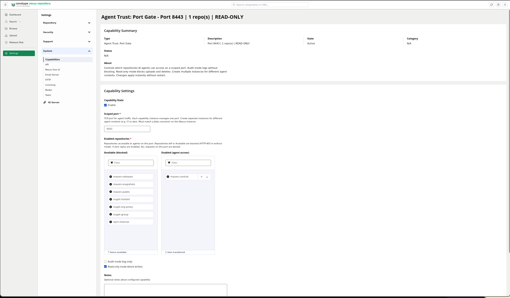
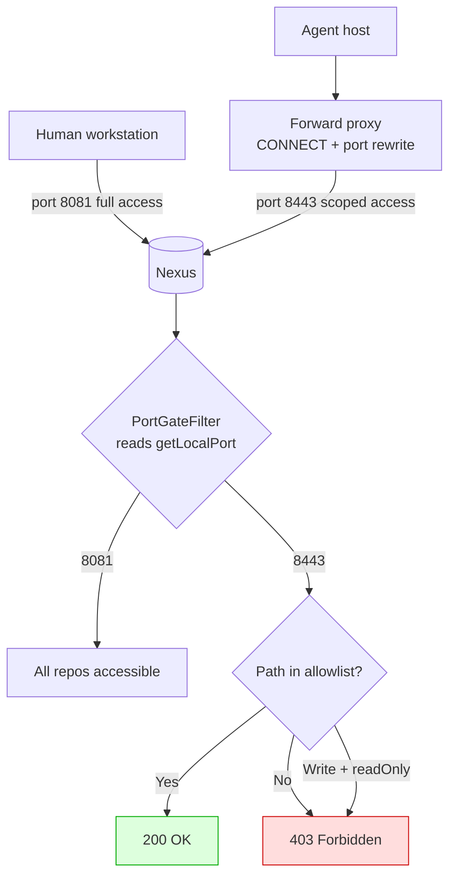
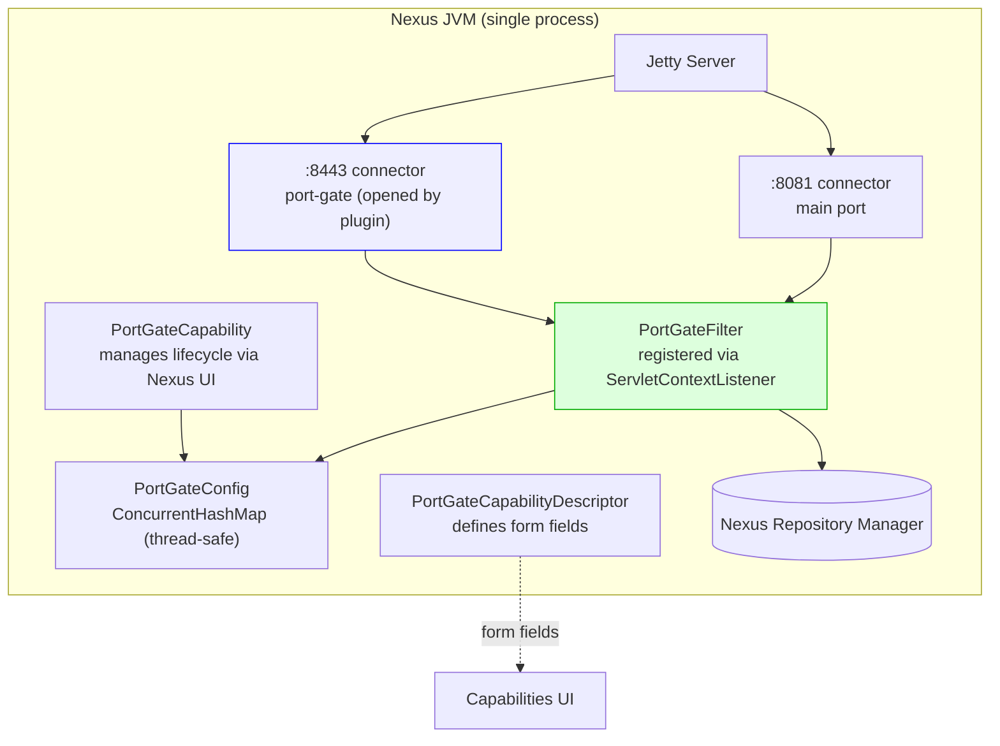

# Nexus Port-Gate Plugin

Scopes AI agent access to trusted repositories on Sonatype Nexus Repository 3.78+.

The plugin opens a second Jetty connector on a configurable port. Traffic
on that port is gated: only repositories selected in the Nexus UI are
accessible. Traffic on the main Nexus port is unaffected.



## Table of contents

- [What it does](#what-it-does)
- [How it works](#how-it-works)
- [Requirements](#requirements)
- [Quick start](#quick-start)
- [Configuration](#configuration)
- [Modes](#modes)
- [Audit logging](#audit-logging)
- [Architecture](#architecture)
- [Source files](#source-files)
- [Building](#building)
- [Nexus 3.93 compatibility notes](#nexus-393-compatibility-notes)

## What it does

AI coding agents (Claude Code, opencode, Cursor) run `npm install`, `pip
install`, and similar commands as subprocesses of the user's shell. They
inherit the user's Nexus credentials and can access every repository the
user can read.

This plugin adds a scoped port to Nexus. Agents route their traffic through
a forward proxy that connects to the scoped port. On that port, only
repositories explicitly enabled in the capability UI are served. Everything
else returns HTTP 403.

The main Nexus port keeps full access for human users.

## How it works



The plugin opens a second Jetty connector at startup via reflection on the
running Server. The connector shares the same servlet context and filter
chain as the main port, so all Nexus features work identically on both
ports. The only difference is the PortGateFilter, which checks
`request.getLocalPort()` and gates `/repository/*` paths.

## Requirements

- Sonatype Nexus Repository 3.78+ (Community or Pro)
- Java 17+ (for building; Nexus 3.93 ships with Java 21)
- Docker (for building and running)

## Quick start

```bash
# Build the custom Nexus image with the plugin baked in
docker build -t nexus-portgate .

# Start Nexus with the scoped port enabled
docker run -d \
    --name nexus \
    -p 8081:8081 \
    -p 8443:8443 \
    -e INSTALL4J_ADD_VM_PARAMS="-Djava.util.prefs.userRoot=/nexus-data/javaprefs -Dportgate.port=8443" \
    nexus-portgate
```

Wait 60-120 seconds for Nexus to boot, then:

1. Open `http://localhost:8081` and log in (admin / admin123 on first run)
2. Go to **Administration > System > Capabilities**
3. Click **Create** > select **Agent Trust: Port Gate**
4. Set the scoped port to `8443`
5. Move repositories from **Available** to **Enabled**
6. Optionally check **Audit mode** or **Read-only mode**
7. Click **Save**

Changes take effect immediately. No restart needed.

To verify the scoped port is working:

```bash
# Port 8081: full access (human)
curl -u admin:admin123 http://localhost:8081/repository/maven-central/

# Port 8443: scoped access (agent)
curl -u admin:admin123 http://localhost:8443/repository/maven-central/   # enabled repo: 200
curl -u admin:admin123 http://localhost:8443/repository/npm-internal/    # blocked repo: 403
```

## Configuration

### JVM argument

```
-Dportgate.port=8443
```

Add to `INSTALL4J_ADD_VM_PARAMS` (Docker) or `nexus.vmoptions` (bare metal).
Controls which port the second Jetty connector opens. Must match the
scoped port configured in the capability UI.

### Capability properties (via Nexus UI)

| Property | Type | Default | Description |
|---|---|---|---|
| `scopedPort` | number | 8443 | TCP port to gate. Must match `-Dportgate.port`. |
| `enabledRepos` | itemselect | (empty) | Repositories accessible to agents. Two-column picker listing all Nexus repos. |
| `auditMode` | checkbox | unchecked | Log what would be denied without blocking. For testing. |
| `readOnly` | checkbox | unchecked | Block POST/PUT/DELETE/PATCH. Agents can read but not write. |

Multiple capability instances can coexist, each managing a different port.
For example: port 8443 for CI agents, port 8444 for dev agents.

## Modes

| Mode | GET enabled repo | GET blocked repo | POST/PUT/DELETE |
|---|---|---|---|
| **Enforce** (default) | 200 ALLOW | 403 DENY | 200 (if repo enabled) |
| **Enforce + Read-only** | 200 ALLOW | 403 DENY | 403 DENY |
| **Audit** | 200 ALLOW | 200 (logged) | 200 (logged) |
| **Audit + Read-only** | 200 ALLOW | 200 (logged) | 200 (logged) |

**Enforce mode** is the production setting. Blocked requests return HTTP 403.

**Audit mode** lets everything through but logs what it would have denied.
Use this to validate your allowlist before switching to enforcement.

**Read-only mode** blocks all write operations (uploads, deletes, publishes)
on the scoped port regardless of the allowlist. Agents can download
dependencies but cannot push artifacts.

## Audit logging

Every decision on a scoped port is logged at INFO (ALLOW) or WARN (DENY):

```
INFO  Port-gate: ALLOW port=8443 user=admin ip=10.0.0.5 path=/repository/maven-central/junit/junit-4.13.2.jar
WARN  Port-gate: DENY  port=8443 user=admin ip=10.0.0.5 path=/repository/npm-internal/express
WARN  Port-gate: DENY  port=8443 user=admin ip=10.0.0.5 method=PUT path=/repository/maven-releases/lib.jar (write blocked by read-only mode)
WARN  Port-gate: AUDIT-DENY port=8443 user=admin ip=10.0.0.5 path=/repository/npm-internal/express (would be blocked in enforce mode)
```

Filter the log:

```bash
# All port-gate decisions
docker logs nexus 2>&1 | grep "Port-gate:"

# Only denials
docker logs nexus 2>&1 | grep "Port-gate:.*DENY"

# Only audit-mode denials (what would be blocked)
docker logs nexus 2>&1 | grep "AUDIT-DENY"
```

## Architecture



### Component roles

| Class | Role |
|---|---|
| `PortGateFilterRegistrar` | ServletContextListener. Registers the filter for `/repository/*` and opens the second Jetty connector via reflection. |
| `PortGateFilter` | Servlet filter. Checks `getLocalPort()`, gates repository paths based on config. Logs every decision. |
| `PortGateConfig` | Thread-safe config holder. ConcurrentHashMap of port to (allowlist, audit, readOnly). Updated by capability lifecycle. |
| `PortGateCapability` | Nexus Capability. Manages one port's config via the UI. Lifecycle hooks push config to PortGateConfig. |
| `PortGateCapabilityDescriptor` | Defines the form fields shown in the Nexus UI. |

### How the connector is opened

The `PortGateFilterRegistrar` runs as a `ServletContextListener`, which
Spring Boot discovers and calls during servlet context initialization.
At that point the Jetty Server is running. The listener walks the
ServletContext's class hierarchy to find the `this$0` inner-class
reference back to Jetty's `WebAppContext`, then calls `getServer()` to
get the Server. A new `ServerConnector` is created, added to the Server,
and started.

This bypasses the need for Spring Boot's `WebServerFactoryCustomizer`
(which Nexus 3.93 overrides) and `FilterRegistrationBean` (which uses
jakarta.servlet, unavailable in Nexus).

## Source files

```
src/main/java/com/sonatype/nexus/plugins/portgate/
    PortGateConfig.java               Thread-safe config holder
    PortGateFilter.java               Servlet filter (gates /repository/*)
    PortGateFilterRegistrar.java      Opens connector + registers filter
    PortGateCapability.java           Nexus Capability (lifecycle + config)
    PortGateCapabilityDescriptor.java UI form definition
```

## Building

The plugin compiles inside a Docker image that extracts the Nexus fat JAR
and compiles against its classes. No external Maven repository needed.

```bash
docker build -t nexus-portgate .
```

This produces a Docker image based on `sonatype/nexus3:latest` with the
plugin baked in, a `loader.properties` for classpath, and a second
Jetty connector configured to open at startup.

### Building without Docker (advanced)

If you have access to Sonatype's internal Maven repository:

```bash
mvn clean package
# Copy the JAR to $NEXUS_HOME/deploy/ (Nexus < 3.78 only)
# For 3.78+, inject into BOOT-INF/lib/ or use loader.path
```

## Nexus 3.93 compatibility notes

Nexus 3.78+ removed OSGi/Karaf bundle support. The old `deploy/` directory
and KAR file approach no longer work. This plugin uses:

- **Spring Boot component scanning**: classes in `com.sonatype.nexus.*` are
  discovered by Spring via `@Named` annotations (javax.inject).
- **Sisu discovery**: `META-INF/sisu/javax.inject.Named` lists all beans.
- **loader.properties**: Spring Boot's PropertiesLauncher loads the plugin
  JAR from `/opt/sonatype/nexus/plugins/` via `loader.path`.
- **`@AvailabilityVersion`**: required by Nexus 3.78+'s
  `DatabaseCheckImpl.isAllowedByVersion()` to register capability types.
- **`coreui_Repository.read`** (ExtDirect `len:0`): used instead of
  `readReferences` (`len:1`) because the itemselect widget sends `data:null`.
- **ServletContextListener**: used instead of `FilterRegistrationBean`
  (which references `jakarta.servlet`, unavailable in Nexus).

## License

Same as the parent project.
